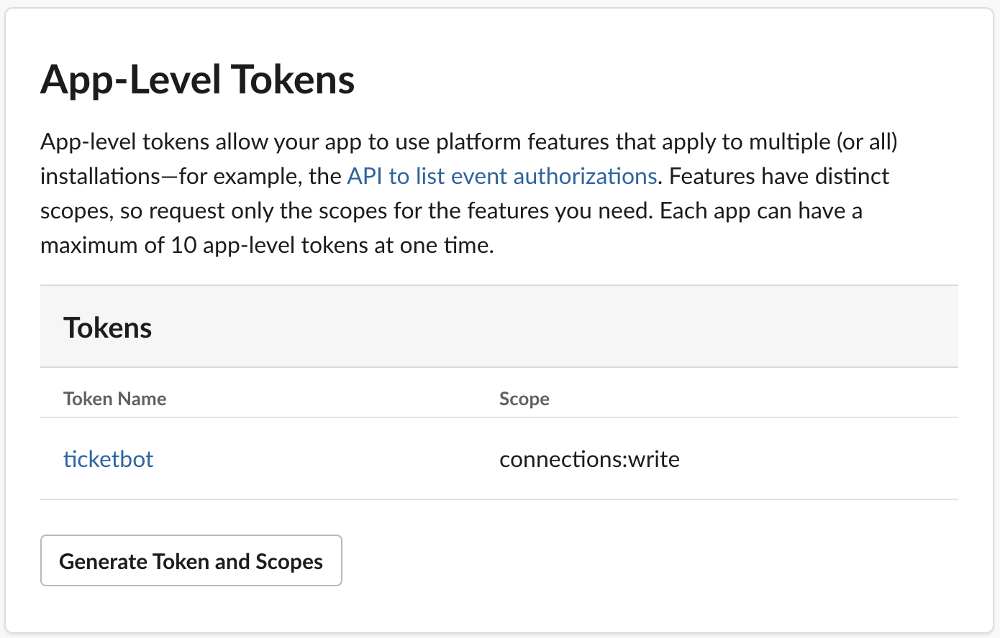
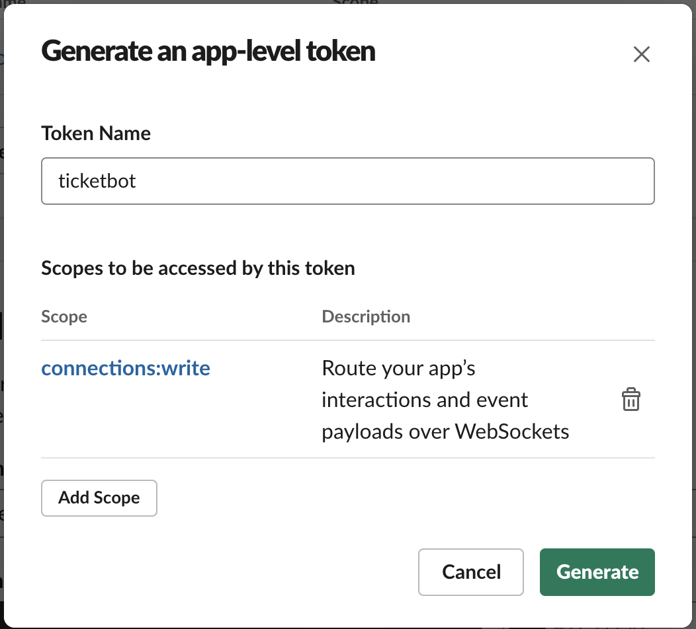
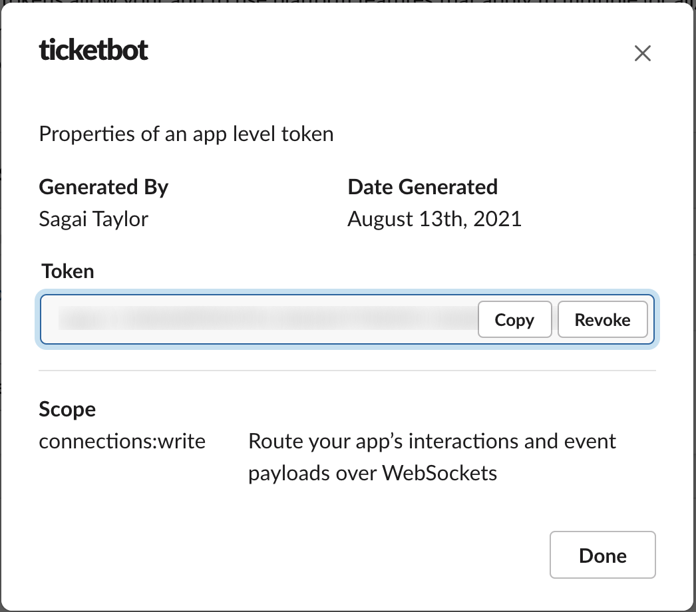
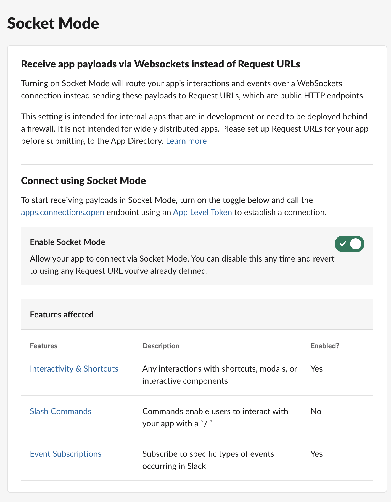
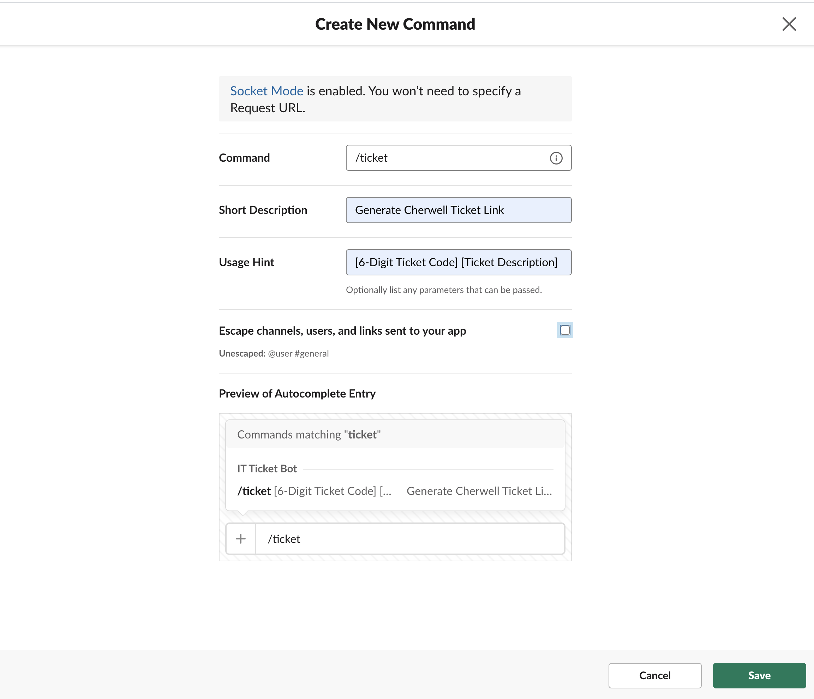
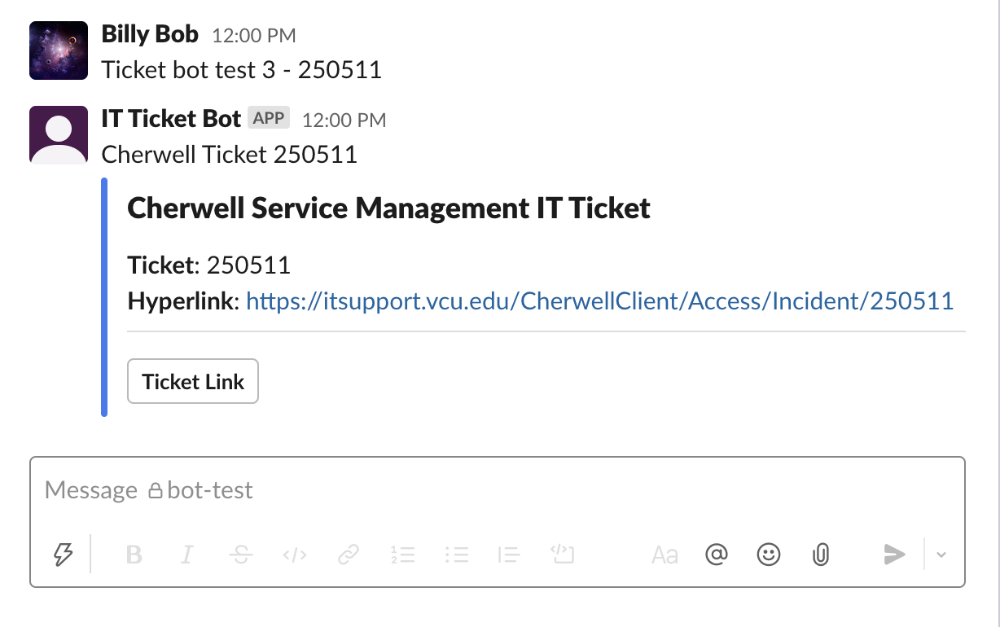

# Cherwell-Slackbot - Websocket Version using Slack Bolt Framework
Slack-bot that listens (using socket mode) in on slack conversation for a user to type in a 6-digit Cherwell service management ticket number, and returns the corresponding hyperlink to said Cherwell ticket. 

## Requirements
* Have a Slack app ready for usage. Click [here](https://api.slack.com/authentication/basics#creating) for instructions if you don't have a slack app created


## Installation
* Navigate to the root directory of this project, and create a virtual environment: 
```bash
User@User Cherwell-Slackbot $ python3 -m venv cherbot_env
```

* Activate the virtual environment packaged within this project.
* Indication that you've entered the virtual environment is the presence of parentheses and the name of the virtual environment preceding the username in the terminal: 
```bash
(Cherwell-Slackbot) User@User Cherwell-Slackbot $ source cherbot_env/bin/activate
```
* Download package dependecies: 
```bash
(Cherwell-Slackbot) User@User Cherwell-Slackbot $ pip3 install -r requirements.txt
```
* Check to confirm that dependecies have been downloaded:
```bash
(Cherwell-Slackbot) User@User Cherwell-Slackbot $ pip3 list

Package       Version
------------- -------
pip           21.2.4
python-dotenv 0.19.0
setuptools    49.1.3
slack-bolt    1.8.0
slack-sdk     3.9.0
```


## Generate Bot Token
* Click [here](https://api.slack.com/apps) to view the list of your Slack apps and select your Slack app. Click the Slack app you've created for this project. 


* Next, go to the **OAUTH & Permissions** tab, and add the following OAUTH scopes under the **Scopes** tab.  
  * ***channels:history***
  * ***chat:write***
  * ***groups:history***
  * ***im:history***
  * ***mpim:history***
* After adding these scopes, **Reinstall** the app to the workspace, and take note of the Bot User Token: 

<p float="left">
  
  
</p>

## Generate App Token
* Next, navigate back to the slack app homepage. 
* Go to the section **App-Level Tokens**
* Click **Generate Token and Scopes**:


* Create a new App Token and name it **ticketbot**
* Next, add the **connections:write** scope, and click the **Generate** button: 


* After generating the App token, you should have a page that displays your App token and scopes it has. 
* Take note of the App token we've generated as we will be using it later: 



## Enable Sockets Mode
* Enabling sockets mode allows for our slack app to continously monitor slack channel events without the need of an HTTP endpoint
* Navigate to the setting **Socket Mode** and enable **Socket Mode**:


## Enable Slash Commands
* The slack app will be able to respond to a slash command called `/ticket` if called by the user
* Having a slack command allows for users to send a ticket link in DM's where the bot generating the ticket link may not be possible.
* Navigate to the **Slash Commands** setting and create a new slash command: 

<p float="left">
  
  
</p>

* After creating the command, click the **save** button.


## Setting environmental variables
* Refer back to the **App Token** and the **Bot Token** you created earlier
* Navigate to the root of this project, and create a .env file and set these tokens as environment variables:
```bash
User@User Ticket-Bot $ touch .env

# Sample output
1 SLACK_APP_TOKEN=YourAppToken
2 SLACK_BOT_TOKEN=YourBotToken
3 BASE_LINK=YourCherwellBaseLink
                                                                          
```
**Note**: The `BASE_LINK` variable depends on the institution or version of Cherwell that you are using. Double check the URL of an already existing ticket in your version of Cherwell to find the base link. 

* Save the .env file

## Running the bot as a standalone executable
* If you want to run the bot as a standalone executable, type the following commands: 
```bash 
User@User Cherwell-Slackbot $ chmod u+x bot
User@User Cherwell-Slackbot $ ./bot &
```

## Running the bot as a service on linux
```bash
# Give loadservice script executable permissions
User@User Cherwell-Slackbot $ chmod u+x loadservice.sh
User@User Cherwell-Slackbot $ ./loadservice.sh
```

## Configuring bot service on linux
NOTE: the `bot` file is the python executable that starts the bot
* Open the `loadservice.sh` file with your favorite text editor
```bash
User@User Cherwell-Slackbot $ vi loadservice.sh
```
* Sample output:
```bash
[Unit]
Description=Cherwell Slackbot
after=network-online.target

[Service]
Type=simple
User=root
Restart=on-failure
WorkingDirectory=/opt/Cherwell-Slackbot
ExecStart=/opt/Cherwell-Slackbot/bot

[Install]
WantedBy=multi-user.target
```
* Modify the fields `WorkingDirectory` and `ExecStart` fields per the current directory of where you've placed this project folder.
* For example, if your current directory for the project is `/home/YourUsername/Documents/Cherwell-Slackbot`, with `YourUsername` being your own unique username on your machine, your output may look something like this: 

```bash
[Unit]
Description=Cherwell Slackbot
after=network-online.target

[Service]
Type=simple
User=root
Restart=on-failure
WorkingDirectory=/home/YourUsername/Documents/Cherwell-Slackbot
ExecStart=/home/YourUsername/Documents/Cherwell-Slackbot/bot

[Install]
WantedBy=multi-user.target
```

## Testing
* Open and sign-in to the Slack App either on Desktop or via browser.
* Next, type the command `/invite @YourBotName` into the channel you want to add the bot to and press Enter: 


* Now that the bot is added to the channel, as a different user, type text into the channel including a 6-digit ticket number like ```Ticket Bot Test - Ticket # 250511```

If everything is working properly, you should recieve an output similiar to this: 




## **Contributing**

Pull requests are welcome. For major changes, please open an issue first to discuss what you would like to change.

Please make sure to update tests as appropriate.

## **License**

[MIT](https://choosealicense.com/licenses/mit/)


