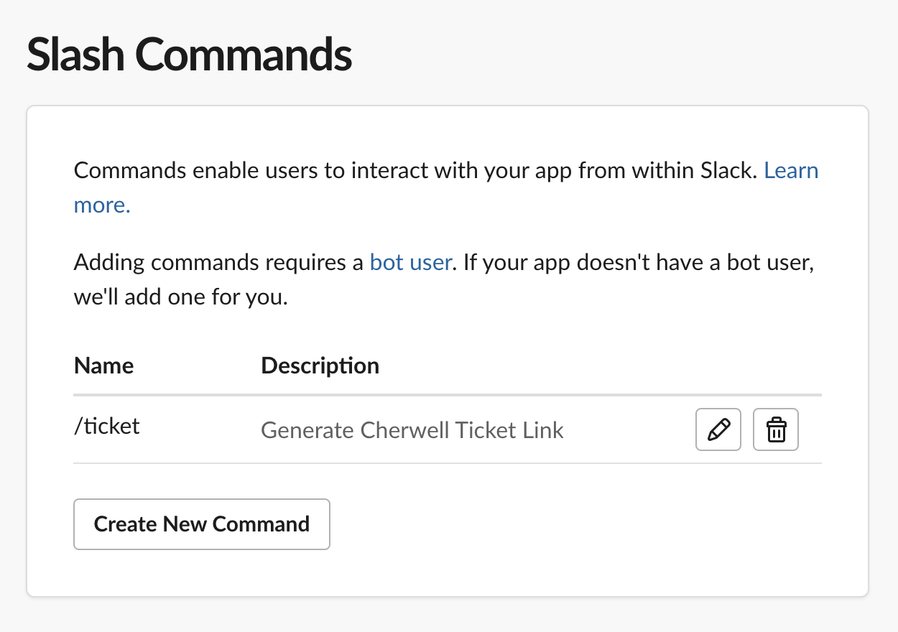

# Cherwell-Slackbot
Slack-bot that listens in on slack conversation for a user to type in a 6-digit Cherwell service management ticket number, and returns the corresponding hyperlink to said Cherwell ticket. 

## Installation
* If Pipenv is not installed on your system, install pipenv via command `pip3 install pipenv`. 
* If pip isn't installed, follow these [instructions](https://pip.pypa.io/en/stable/getting-started/) to install pip on your system
* Next, make sure you are within the root project directory, and install the dependencies required for this project using [pipenv](https://pypi.org/project/pipenv/):
```bash
User@User Ticket-Bot $ pipenv install 
```
* Activate the virtual environment packaged within this project: 
```bash
User@User Ticket-Bot $ pipenv shell
```
* Indication that you've entered the virtual environment is the presence of parentheses and the name of the virtual environment preceding the username in the terminal:
```bash
(Ticket-Bot) User@User Ticket-Bot $
```

## Requirements
* Create a Slack app. Click [here](https://api.slack.com/authentication/basics#creating) for instructions if needed.
* Install Cloudflared using the instructions [here](https://developers.cloudflare.com/cloudflare-one/connections/connect-apps/install-and-setup/installation)
* Authenticate Cloudflare using the instructions [here](https://developers.cloudflare.com/cloudflare-one/connections/connect-apps/install-and-setup/setup)
* Create a Cloudflared argo tunnel. This enables the Slack app to listen in on Slack conversations in real-time. Click [here](https://developers.cloudflare.com/cloudflare-one/connections/connect-apps/create-tunnel) for instructions if needed.


## Enable and Gather Credentials
* Click [here](https://api.slack.com/apps) to view the list of your Slack apps and select your Slack app. Click the Slack app you've created for this project. 
* Take note of the ***Signing Secret*** as seen below in the App info page:


* Next, go to the **OAUTH & Permissions** tab, and add the following OAUTH scopes under the **Scopes** tab.  
  * ***channels:history***
  * ***chat:write***
  * ***groups:history***


* After adding these scopes, **Reinstall** the app to the workspace, and take note of the Bot User Token: 


## Setting environmental variables
* Refer back to the **Signing Secret** and the **Bot Token** you created earlier
* Navigate to the root of this project, and create a .env file and set these tokens as environment variables:
```bash
User@User Ticket-Bot $ touch .env

# Sample output
1 SIGN_SEC=YourSigningSecret
2 SLACK_BOT_TOKEN=YourBotToken
3 BASE_LINK=YourBaseLink
                                                                          
```
* Change BASE_LINK to your liking as the base referral link to tickets is different for each version of Cherwell service management software
* Save the .env file

## Run Cloudflare Tunnel
* Assuming your Cloudflared Argo tunnel is properly configured, run Cloudflared to expose localhost port 5000 to the internet: 
```bash 
User@User Ticket-Bot $ cloudflared tunnel --url localhost 5000
```
* After running the command, output should look like this: 
```bash
2021-08-10T12:57:34Z INF Cannot determine default configuration path. No file [config.yml config.yaml] in [~/.cloudflared ~/.cloudflare-warp ~/cloudflare-warp /etc/cloudflared /usr/local/etc/cloudflared]
2021-08-10T12:57:34Z INF Version 2021.8.2
2021-08-10T12:57:34Z INF GOOS: darwin, GOVersion: go1.16.5, GoArch: amd64
2021-08-10T12:57:34Z INF Settings: map[url:localhost:5000]
2021-08-10T12:57:34Z INF cloudflared will not automatically update when run from the shell. To enable auto-updates, run cloudflared as a service: https://developers.cloudflare.com/argo-tunnel/reference/service/
2021-08-10T12:57:34Z INF Initial protocol h2mux
2021-08-10T12:57:34Z INF Starting metrics server on 127.0.0.1:50274/metrics
2021-08-10T12:57:35Z INF Connection established connIndex=0 location=SJC
2021-08-10T12:57:39Z INF Each HA connection's tunnel IDs: map[0jsdflksdjfklsdjfksjdflksjdflksdjflskdfjkdslf0]
2021-08-10T12:57:39Z INF +------------------------------------------------------------------+
2021-08-10T12:57:39Z INF |  Your free tunnel has started! Visit it:                         |
2021-08-10T12:57:39Z INF |    https://cake-lucky-random-bunko.trycloudflare.com  |
2021-08-10T12:57:39Z INF +------------------------------------------------------------------+
2021-08-10T12:57:39Z INF Route propagating, it may take up to 1 minute for your new route to become functional
2021-08-10T12:57:39Z INF Connection established connIndex=1 location=DFW
2021-08-10T12:57:40Z INF Connection established connIndex=2 location=SJC
2021-08-10T12:57:41Z INF Connection established connIndex=3 location=DFW
```
* The corresponding link in this sample output is: ```https://cake-lucky-random-bunko.trycloudflare.com```
* Take note of the link above. 
* Run the ```bot.py``` script: 
```bash
(Ticket-Bot) User@User Ticket-Bot $ python3 bot.py
```

## Enable Slack Event Subscriptions
* Navigate to the Slack Apps [homepage](https://api.slack.com/apps), and select your app you used for this project
* Navigate to the **Event Subscriptions** tab, and paste the Cloudflared Argo tunnel link you retrieved in the previous section into the **Request URL** field: 
* If everything is working properly, there should be a **Verified** notification near the URL field followed by a ✅ . 


* Next, add the events **messages.channel** and **message.groups** for the Slackbot to subscribe to:


* Reinstall the Slack app if needed. 


## Enable Interactive Components
* Enabling interactive components in our app allows for us to collect user input with the button included in our Cherwell Ticket hyperlink payload. 
* Navigate to the Slack app [homepage](https://api.slack.com/apps), select your app, and go to the **Interactivity and Shortcuts** tab
* Turn on **Interactivity & Shortcuts** and Enter the same URL from Cloudflare into the **Request URL** field:


* If everything is functioning properly, there should be a **Verified** notification near the URL field followed by a ✅ .
* Click the **Save Changes** button, and reinstall the app if needed.

## Testing
* Open and sign-in to the Slack App either on Desktop or via browser.
* Next, type the command `/invite @YourBotName` into the channel you want to add the bot to and press Enter: 


* Now that the bot is added to the channel, as a different user, type text into the channel including a 6-digit ticket number like ```Ticket Bot Test - Ticket # 234211```

If everything is working properly, you should recieve an output similiar to this: 




## **Contributing**

Pull requests are welcome. For major changes, please open an issue first to discuss what you would like to change.

Please make sure to update tests as appropriate.

## **License**

[MIT](https://choosealicense.com/licenses/mit/)


